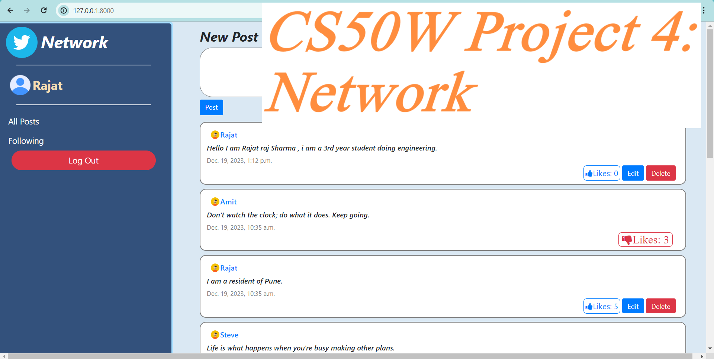
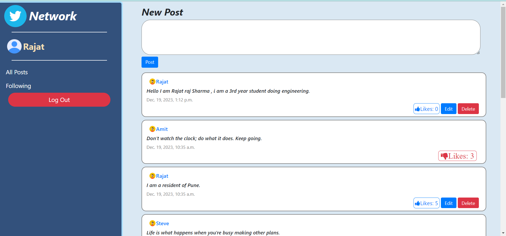
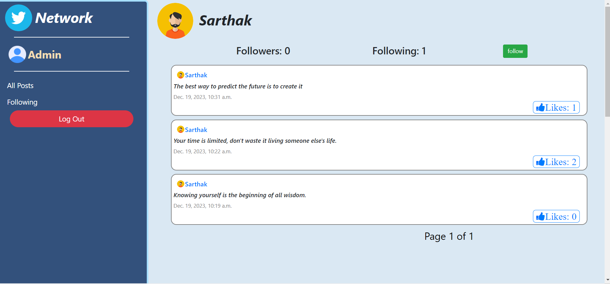
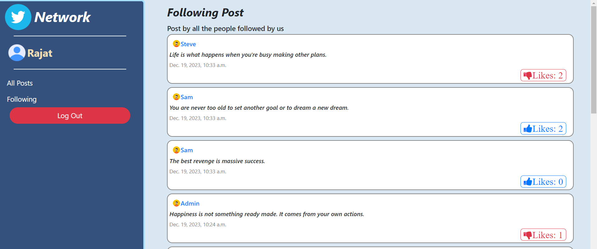

# Network_twitter

🌐 **Dive into the Network_twitter project, a vibrant Django-powered social media platform akin to Twitter!** 🚀 Connect with users, follow/unfollow, like/dislike posts, and craft your unique profile.

## YouTube Showcase

  
  It's a Django-powered social media hub inspired by Twitter! 🚀 Experience personalized user pages, follow/unfollow dynamics, post liking/disliking, and effortless post editing.

## Screenshots

### Home Page

### User Profile Page

### Following Page

## How to Use

To run this code, you need to install:

1. Django: `pip install Django`
2. Django-crispy-forms: `pip install django-crispy-forms`

After installation, run `python manage.py runserver` in the terminal.

## Technologies Used

- Django 🚀
- Python 🐍
- Web Development 💻

## License

This project is licensed under the MIT License - see the [LICENSE](LICENSE) file for details.
